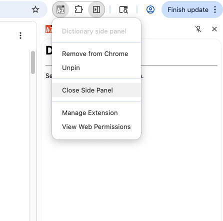

# unc-hci-project
Final project for COMP790-173 F2025

## Test Chrome Extension

1. Clone this repo
2. On Chrome, go to `chrome://extensions`
3. Switch on developer mode and click "load unpacked"

4. Load directory `sample.sidepanel-dictionary` in the root of this repo
5. Click "Open Side Panel" on the new extension

For more extension samples, go to the [chrome repo](https://github.com/GoogleChrome/chrome-extensions-samples/tree/main/functional-samples)